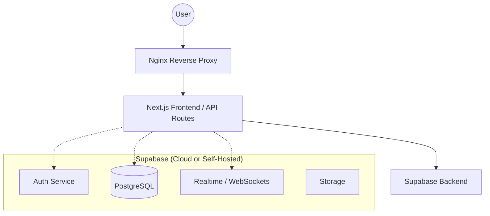

# EnterpriseChat Deployment Guide

This document outlines the architecture and deployment steps for the EnterpriseChat platform.

## System Architecture



## API Design (Rest + Realtime)

### REST Endpoints (via Supabase Client)
- `POST /auth/v1/signup`: User registration
- `POST /auth/v1/login`: User authentication
- `GET /rest/v1/workspaces`: Fetch user workspaces
- `POST /rest/v1/workspaces`: Create new workspace
- `GET /rest/v1/channels`: Fetch workspace channels
- `POST /rest/v1/messages`: Send a message

### Realtime Events (via WebSockets)
- `postgres_changes (table: messages)`: New message notifications
- `postgres_changes (table: profiles)`: Presence and status updates
- `presence`: Real-time user online/offline status

## Docker Deployment

### Dockerfile
```dockerfile
FROM node:18-alpine AS base

# Install dependencies only when needed
FROM base AS deps
RUN apk add --no-cache libc6-compat
WORKDIR /app
COPY package.json yarn.lock* package-lock.json* bun.lockb* ./
RUN npm install

# Rebuild the source code only when needed
FROM base AS builder
WORKDIR /app
COPY --from=deps /app/node_modules ./node_modules
COPY . .
RUN npm run build

# Production image, copy all the files and run next
FROM base AS runner
WORKDIR /app
ENV NODE_ENV production
RUN addgroup --system --gid 1001 nodejs
RUN adduser --system --uid 1001 nextjs
COPY --from=builder /app/public ./public
COPY --from=builder --chown=nextjs:nodejs /app/.next/standalone ./
COPY --from=builder --chown=nextjs:nodejs /app/.next/static ./.next/static
USER nextjs
EXPOSE 3000
ENV PORT 3000
CMD ["node", "server.js"]
```

### Docker Compose
```yaml
version: '3.8'

services:
  enterprise-chat:
    build:
      context: .
      dockerfile: Dockerfile
    ports:
      - "3000:3000"
    environment:
      - NEXT_PUBLIC_SUPABASE_URL=${NEXT_PUBLIC_SUPABASE_URL}
      - NEXT_PUBLIC_SUPABASE_ANON_KEY=${NEXT_PUBLIC_SUPABASE_ANON_KEY}
    restart: always
```

## VPS Deployment Steps (Ubuntu)

1. **Install Docker & Docker Compose**
   ```bash
   sudo apt update
   sudo apt install docker.io docker-compose -y
   ```

2. **Clone the Repository**
   ```bash
   git clone <your-repo-url>
   cd enterprise-chat
   ```

3. **Configure Environment Variables**
   Create a `.env` file with your Supabase credentials.

4. **Start the System**
   ```bash
   docker-compose up -d
   ```

5. **Setup Nginx Reverse Proxy**
   Install Nginx and configure a site to proxy requests to `http://localhost:3000`.

6. **SSL with Let's Encrypt**
   ```bash
   sudo apt install certbot python3-certbot-nginx -y
   sudo certbot --nginx -d yourdomain.com
   ```
